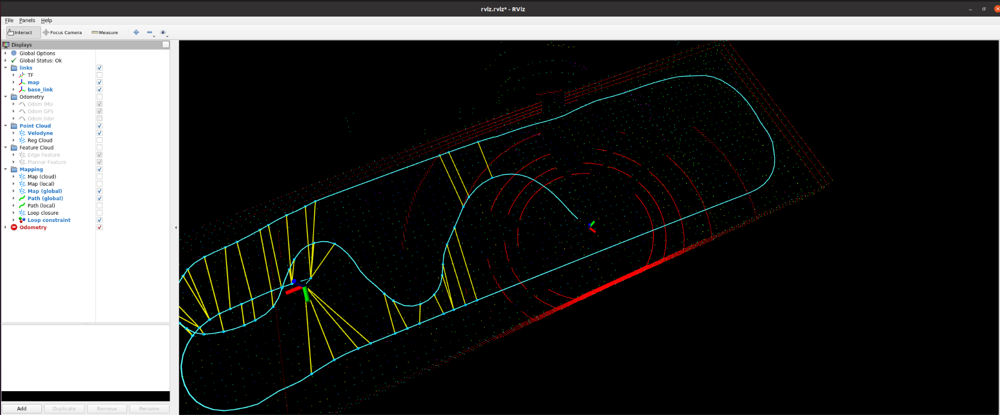
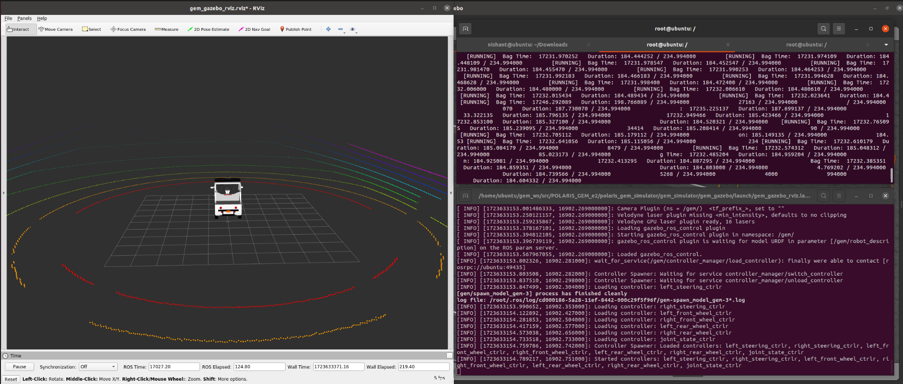
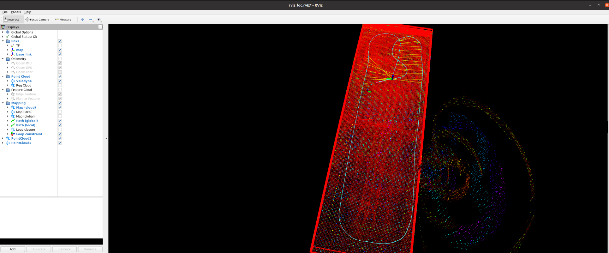
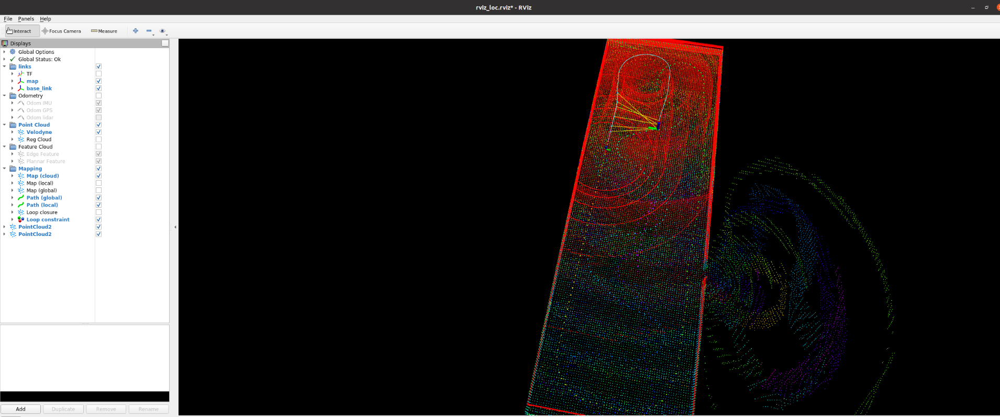

# POLARIS_LIO_SAM

**The tasks include integrating the LIO-SAM algorithm into the POLARIS_GEM_e2 simulation environment, generating a map, modifying the SLAM system to use pre-built maps for localization, and comparing the results with ground truth data from the simulation.**

Key Objectives:

1. Integrate LIO-SAM into POLARIS_GEM_e2 simulator.
2. Generate a detailed map of the simulation environment using LIO-SAM.
3. Modify LIO-SAM to use the pre-built map for real-time localization.
4. Evaluate the modified SLAM system by comparing its localization results with the ground truth data from the simulation.
5. Package the simulation and localization system into a ROS package and Dockerfile, ensuring all dependencies are properly configured for easy setup.

<p align='center'>
    
    
    
    
</p>

Most of the code base is taken from [POLARIS GEM E2](https://gitlab.engr.illinois.edu/gemillins/POLARIS_GEM_e2) & [LIO_SAM](https://github.com/TixiaoShan/LIO-SAM)

## Dependency

This is the original ROS1 implementation of LIO-SAM.

- [ROS](http://wiki.ros.org/ROS/Installation) (tested with Noetic)
  ```
  sudo apt-get install -y ros-noetic-navigation
  sudo apt-get install -y ros-noetic-robot-localization
  sudo apt-get install -y ros-noetic-robot-state-publisher
  ```
- [gtsam](https://gtsam.org/get_started/) (Georgia Tech Smoothing and Mapping library)
  ```
  sudo add-apt-repository ppa:borglab/gtsam-release-4.0
  sudo apt install libgtsam-dev libgtsam-unstable-dev
  ```

## Install

Use the following commands to download and compile the package.

```
cd ~/catkin_ws/src
git clone https://github.com/Nishant-Ramakuru/POLARIS_LIO_SAM.git
cd ..
catkin_make
```

## Using Docker
Build image (based on ROS1 Noetic):

```bash
docker build -t gem-lio-noetic-image .
```

Once you have the image, start a container as follows:

```bash
docker run -dt --name gem-lio-noetic-1 \
  --env="DISPLAY" --net host \
  -v /etc/localtime:/etc/localtime:ro \
  -v /etc/timezone:/etc/timezone:ro \
  -v /tmp/.X11-unix:/tmp/.X11-unix \
  -v /path/to/datasets-folder/data:/home/ubuntu/data \
  gem-lio-noetic-image /bin/bash
```

    
## Run the packages inside the docker container with bag files

* ### Setup terminal

  Setup should be executed for every instance of a new terminal window

1. Docker Access:
```
xhost +local:docker
```

2. Initiate the container:
```
docker start gem-lio-noetic-1
```

3. Access docker container:
```
docker exec -it gem-lio-noetic-1 bash
```
* ## Datasets
  
  * Download the data and copy it inside the data folder in the container. [dataset](https://drive.google.com/drive/folders/1jkLbEMqNMFf54G64oEmlZuGM7DaNc-KV?usp=drive_link)
    ```
    docker cp /home/user-name/Downloads my_container:/home/ubuntu/data/
    ```

* ### Generate map

1. Source setup file
```
source /home/ubuntu/polaris_lio_sam_ws/devel/setup.bash
```

2. Mapping:
```
roslaunch polaris_lio_sam run.launch config_file:="/home/ubuntu/polaris_lio_sam_ws/src/POLARIS_LIO_SAM/config/params_gem.yaml"
```

3. Publish translational transformation between world and map frame
```
rosrun tf2_ros static_transform_publisher 22.5 -1.0 0.0 0.0 0.0 0.0 1.0 world map
```

4. Run bag files:
```
rosbag play /home/ubuntu/data/highbay_track.bag --start 115
```

5. Save the map:
```
rosservice call /lio_sam/save_map 0.2 "/home/ubuntu/data/maps/"
```

* ### Modify Params
1. Edit config file *loadMapFileDir:="/home/ubuntu/data/<dir-name-given>/"*
```
gedit "/home/ubuntu/polaris_lio_sam_ws/src/POLARIS_LIO_SAM/config/params_gem.yaml" 
```
  

* ### Localization on pre-built map

1. Source the required setup.bash
```
source /home/ubuntu/polaris_lio_sam_ws/devel/setup.bash
```

2. Run the mapping launch file 
```
roslaunch polaris_lio_sam run_loc.launch config_file:="/home/ubuntu/polaris_lio_sam_ws/src/POLARIS_LIO_SAM/config/params_gem.yaml" 
```
3. Publish transformation between world and map frame
```
rosrun tf2_ros static_transform_publisher 22.5 -1.0 0.0 0.0 0.0 0.0 1.0 world map

4. Run bag files:
```
rosbag play /home/ubuntu/data/highbay_track.bag --start 115
```

## Polaris simulation
1. Source setup.bash
```
source /home/ubuntu/gem_ws/devel/setup.bash
```

3. Launch Polaris simulation:
```
roslaunch gem_gazebo gem_gazebo_rviz.launch world_name:=./worlds/highbay_track.world x:=0 y:=0 velodyne_points:="true"
```

4. Published transformation between velodyne and gem/velodyne frame
```
rosrun tf2_ros static_transform_publisher 0 0 0 0 0 0 /velodyne gem/velodyne
```
